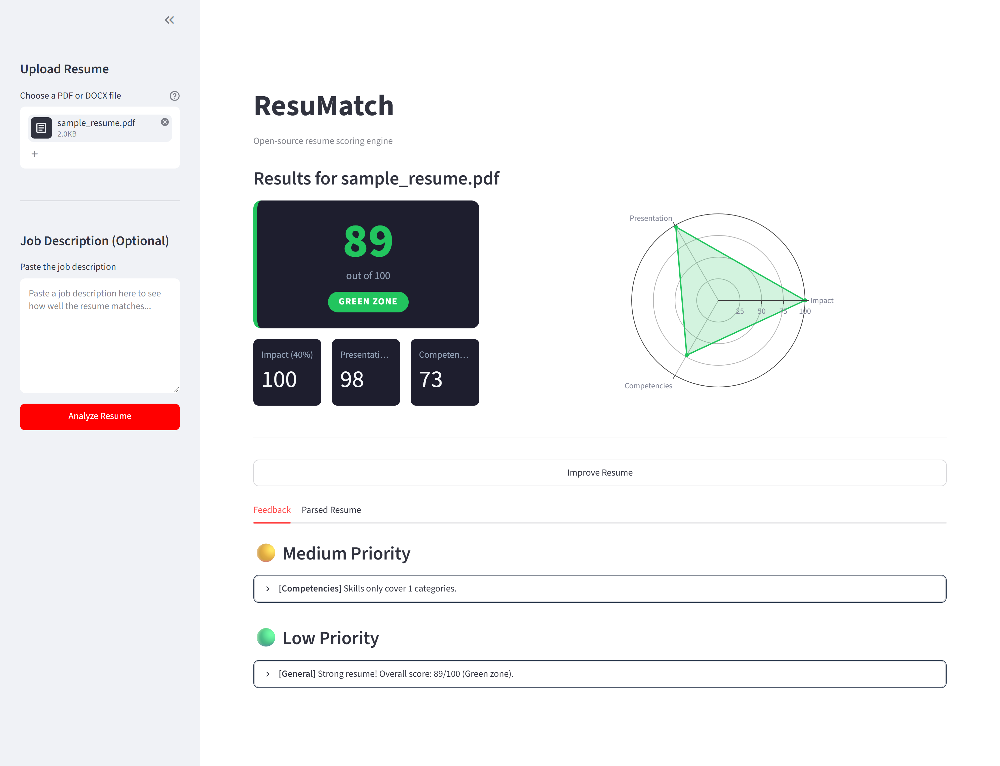
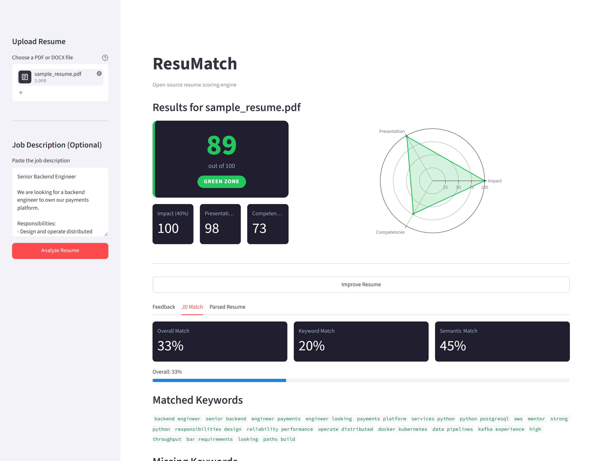
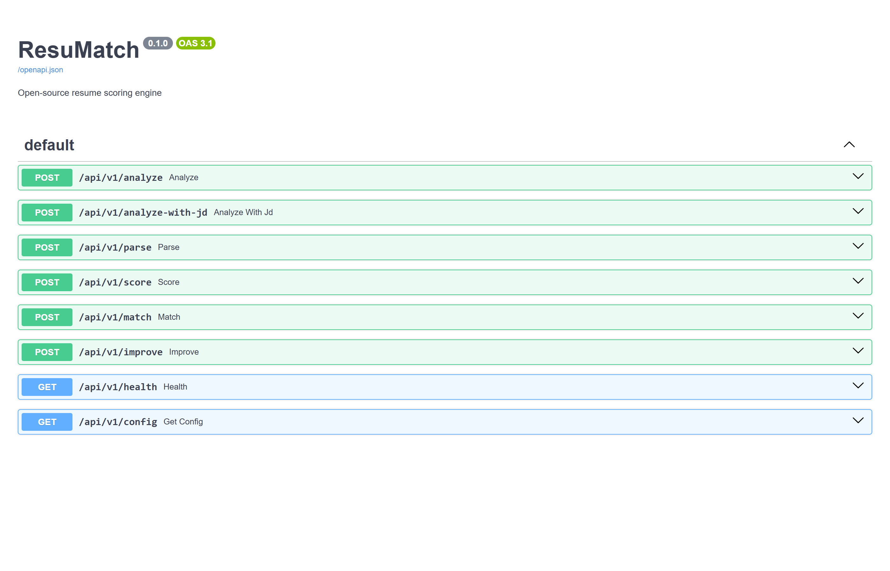
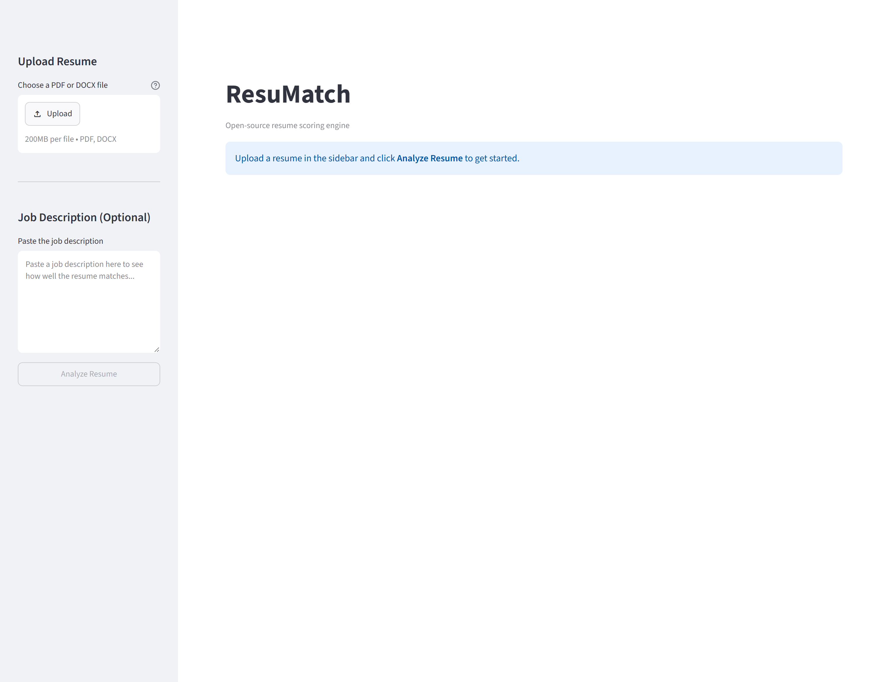

# ResuMatch

**Score any resume out of 100, see exactly why, and find out how well it
matches a job description — entirely on your own machine.**

[](https://www.python.org/downloads/)
[](LICENSE)
[](#run-the-tests)
[](#faq)

ResuMatch is an open-source resume scoring engine, modelled on the approach
described in VMock's patent [US10346803B2](https://patents.google.com/patent/US10346803B2/en).
Upload a PDF or Word document and it reads the sections, measures how the
bullets are written, scores three separate dimensions, and tells you what to
fix first.

No account. No API key. No upload to anyone's server. The resume never leaves
your computer.

---

## See it work

Upload a resume, get a score and a breakdown:



Paste in a job description and it tells you how well the two line up, which
keywords hit, and which are missing:



Everything the dashboard does is also a REST endpoint:



---

## Table of contents

- [Install it](#install-it)
- [Run it](#run-it)
- [How the scoring works](#how-the-scoring-works)
- [Using the API](#using-the-api)
- [Configuration](#configuration)
- [Run with Docker instead](#run-with-docker-instead)
- [Run the tests](#run-the-tests)
- [Troubleshooting](#troubleshooting)
- [FAQ](#faq)

---

## Install it

### Step 0 — what you need

| Requirement | Why | Required? |
|---|---|---|
| **Python 3.12+** | Everything | Yes |
| **~2 GB disk** | spaCy and sentence-transformer models | Yes |
| **A Java runtime** | `language-tool-python` runs LanguageTool for grammar checking | Optional — see below |

Check Python first:

```bash
python --version
```

If it says 3.11 or lower, or "command not found", install Python from
[python.org/downloads](https://www.python.org/downloads/).

> **About Java:** without it, the grammar component of the Presentation score
> is skipped and everything else works normally. If you want grammar checking,
> install any JRE 8+ (`sudo apt install default-jre`,
> `brew install openjdk`, or [adoptium.net](https://adoptium.net/) on Windows).

### Step 1 — get the code

```bash
git clone https://github.com/YOUR-USERNAME/resumatch.git
cd resumatch
```

No git? Green **Code** button → **Download ZIP** → unzip → `cd` into it.

### Step 2 — make a virtual environment

**macOS / Linux**

```bash
python -m venv .venv
source .venv/bin/activate
```

**Windows (PowerShell)**

```powershell
python -m venv .venv
.venv\Scripts\Activate.ps1
```

Your prompt should now begin with `(.venv)`.

### Step 3 — install

```bash
pip install -e ".[dashboard]"
python -m spacy download en_core_web_sm
```

The second line is not optional — spaCy needs its English model and it is not
bundled with the package. It downloads about 12 MB.

> First run only: the job-description matcher also pulls a
> sentence-transformer model (~90 MB) the first time you use it. Everything
> else works before that finishes.

---

## Run it

ResuMatch is two processes: an API that does the work, and a dashboard that
talks to it. **Start the API first.**

### Terminal 1 — the API

```bash
uvicorn resumatch.api:app --port 8510
```

Check it's alive:

```bash
curl http://localhost:8510/api/v1/health
```

```json
{"status":"ok","spacy_loaded":true,"llm_available":false,"models_loaded":false,"version":"0.1.0"}
```

`spacy_loaded: true` is the one that matters. If it's `false`, go back and run
the `spacy download` command from Step 3.

### Terminal 2 — the dashboard

```bash
streamlit run resumatch/dashboard/app.py --server.port 8511
```

Open **http://localhost:8511**. You'll see this:



Then:

1. **Choose a PDF or DOCX file** in the left sidebar.
2. *(Optional)* paste a job description underneath it.
3. Click **Analyze Resume**.

That's the whole loop. No sign-in, no configuration.

> Running the dashboard on a different machine or port from the API? Set
> `RESUMATCH_API_URL=http://wherever:8510` before starting it.

### Just want the score, no browser?

```bash
curl -X POST http://localhost:8510/api/v1/analyze -F "file=@resume.pdf"
```

---

## How the scoring works

Your overall score out of 100 is a weighted blend of three independent
modules:

| Module | Weight | What it actually measures |
|---|---|---|
| **Impact** | 40% | Strong action verbs (147 of them) versus weak ones (26), how many bullets carry a number, and how specific the language is |
| **Presentation** | 20% | Page count, grammar errors, whether the expected sections exist, formatting consistency |
| **Competencies** | 40% | How many distinct skills appear and how many categories they span (technical, leadership, communication, analytical, domain) |

Then it lands in a zone:

| Zone | Range |
|---|---|
| 🟢 Green | 85 – 100 |
| 🟡 Yellow | 50 – 84 |
| 🔴 Red | 0 – 49 |

Feedback comes back sorted by priority — HIGH before MEDIUM before LOW — so
the first thing on the list is the thing worth fixing first.

Full detail, including every formula:
[docs/scoring_methodology.md](docs/scoring_methodology.md).

### Job-description matching

When you supply a job description, ResuMatch scores the fit two ways and
averages them:

- **Keyword match** — KeyBERT pulls the top keywords out of the posting, then
  checks which ones actually appear in the resume.
- **Semantic match** — sentence-transformers compares meaning, so "led a team
  of engineers" can match "engineering management" without sharing a word.

You get both numbers separately, plus the matched and missing keyword lists,
because a low keyword score with a high semantic score means something quite
different from the reverse.

---

## Using the API

Eight endpoints, all under `/api/v1`. Interactive docs are served at
**http://localhost:8510/docs** while the API is running.

```bash
# Score a resume
curl -X POST http://localhost:8510/api/v1/analyze \
  -F "file=@resume.pdf"

# Score it against a job description
curl -X POST http://localhost:8510/api/v1/analyze-with-jd \
  -F "file=@resume.pdf" \
  -F "jd_text=We are looking for a backend engineer..."

# Just the parsed structure, no scoring
curl -X POST http://localhost:8510/api/v1/parse -F "file=@resume.pdf"

# Is it up?
curl http://localhost:8510/api/v1/health

# What settings is it running with?
curl http://localhost:8510/api/v1/config
```

The rest: `/score`, `/match`, `/improve`.

`/improve` is the only endpoint that needs a language model — see
[Configuration](#configuration). Every other endpoint works without one.

---

## Configuration

All settings live in `config.yaml`. You don't have to edit that file: any
value in it can be overridden with an environment variable named
`RESUMATCH_<SECTION>__<KEY>` — note the **double** underscore separating the
section from the key.

```bash
RESUMATCH_API__PORT=9000                          # move the API
RESUMATCH_SCORING__ZONES__GREEN=90                # raise the bar for green
RESUMATCH_LLM__BASE_URL=http://localhost:11434    # point at your own model
RESUMATCH_LLM__ENABLED=false                      # turn the model off entirely
```

Naming a key that doesn't exist in `config.yaml` is a **startup error**, not a
silent no-op — so a typo tells you immediately instead of quietly doing
nothing.

See [`.env.example`](.env.example) for the full list. A `.env` file in the
project folder is picked up automatically.

### The optional language model

`/api/v1/improve` rewrites weak bullet points. It talks to any
OpenAI-compatible endpoint — llama.cpp's server, LM Studio, Ollama, vLLM —
whatever you already run. Point `RESUMATCH_LLM__BASE_URL` at it.

With nothing reachable, `/improve` returns `llm_available: false` and every
other endpoint is completely unaffected. Every screenshot in this README was
produced with the model disabled.

---

## Run with Docker instead

If you'd rather not install Python packages at all:

```bash
docker compose up -d
```

- API → http://localhost:8510
- Dashboard → http://localhost:8511

The first build takes a while — it installs PyTorch. Stop it with
`docker compose down`.

---

## Run the tests

```bash
pip install -e ".[dev,dashboard]"
python -m spacy download en_core_web_sm
pytest tests/ -q
```

343 tests, about 10 seconds, no skips.

They aren't only unit tests of the arithmetic:

- `test_ingest_integration.py` parses **real** PDF and DOCX fixtures with
  nothing mocked, so pdfplumber and python-docx handle actual bytes.
- `test_api_journey.py` posts those same files at `/analyze` and
  `/analyze-with-jd` through the entire unmocked pipeline.
- `test_dashboard_apptest.py` renders the real Streamlit app through
  Streamlit's own `AppTest` and asserts on what the page shows.
- `test_config_env.py` proves the environment-override layer both applies
  overrides and rejects unknown keys.

Every test runs with real network access blocked, so a test can never
accidentally depend on something being online.

To skip the slower model-loading tests: `pytest tests/ -q -m "not slow"`.

---

## Troubleshooting

**`spacy_loaded: false` in the health check, or "Can't find model 'en_core_web_sm'"**
Run `python -m spacy download en_core_web_sm` with your virtual environment
active.

**"Cannot connect to API at http://localhost:8510. Is the server running?"**
The dashboard is up but the API isn't. Start it in another terminal
(`uvicorn resumatch.api:app --port 8510`). If your API is elsewhere, set
`RESUMATCH_API_URL`.

**The Presentation score seems high and grammar is never mentioned**
No Java runtime, so grammar checking was skipped. See
[Step 0](#step-0--what-you-need). This is by design, not a failure.

**The first job-description match takes 30+ seconds**
It's downloading the sentence-transformer model. Only happens once.

**`ModuleNotFoundError: No module named 'streamlit'`**
You installed the core only. Run `pip install -e ".[dashboard]"`.

**`ConfigError: RESUMATCH_FOO__BAR does not match any setting in config.yaml`**
Working as intended — you set an override for a key that doesn't exist. Check
the spelling, and remember the separator is two underscores.

**Upload rejected as too large**
Default limit is 10 MB. Raise it with `RESUMATCH_API__MAX_UPLOAD_MB=25`.

---

## FAQ

**Does my resume get uploaded anywhere?**
No. Parsing, scoring, feedback and matching all run in your own process. The
only outbound request ResuMatch can make is to a language model endpoint you
configured yourself, and that is off by default. The test suite blocks real
network calls, so this is enforced rather than promised.

**Do I need an API key or an account?**
No, and there is nothing paid anywhere in this project.

**Is this the same algorithm VMock uses?**
No. It's an independent open-source implementation of the *approach* their
patent describes. Same idea, different code, no affiliation.

**Why are Impact and Competencies weighted so much higher than Presentation?**
Because formatting is the easiest thing to fix and the least predictive of
anything. What you did and what you can do carry the weight.

**Can I change the weights?**
Yes — `scoring.weights` in `config.yaml`, or
`RESUMATCH_SCORING__WEIGHTS__IMPACT=50` and friends.

**What file formats does it read?**
PDF (via pdfplumber) and DOCX (via python-docx). Not `.doc`, not `.pages`.

---

## Tech stack

| Layer | What |
|---|---|
| API | FastAPI + uvicorn |
| Dashboard | Streamlit + Plotly |
| NLP | spaCy, sentence-transformers, KeyBERT |
| Grammar | language-tool-python (runs locally) |
| Parsing | pdfplumber (PDF), python-docx (DOCX) |
| Language model | Optional, any OpenAI-compatible endpoint |

Every dependency is free and open source.

## License

MIT — see [LICENSE](LICENSE).
